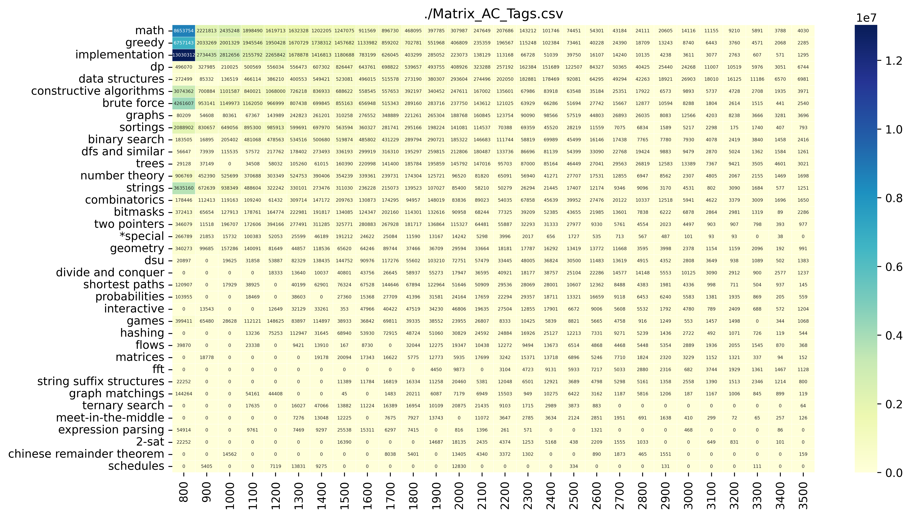

# Codeforces Crawler

一个巨简单的cf爬虫。

codeforces.py爬取Problemset中的所有题目并制作csv表，datavisual.py根据csv表绘图。

用的时候直接

    python3 ./codeforces.py
    python3 ./datavisual.py

就行。

**没做任何异常处理**，所以要注意文件是否存在的问题。

制表和绘图参考了[这位大佬的代码](https://github.com/Greenwicher/Awsome-Project/tree/master/Codeforces%20Guide)，当时Codeforces还没有rating功能，现在有了，难度就可以直接用rating来判断了。

## 效果图

## 功能

- 爬取Codeforces Problemset中的所有题目
- 爬取指定用户的所有提交记录（默认是托老爷的）
- 制作题目表、全站AC数和题目标签的关系矩阵、题目数和题目标签的关系矩阵
- 将关系矩阵绘制成热力图

## 坑

1. 用户状态里AC题目所对应的verdict是"OK"，其他WA、RE、TLE什么的没变
2. 截至2020.4.10只有[Contest921](https://codeforces.com/contest/921)中的题目ID不符合“数字+字母（+数字）”的格式而是“数字+数字”，我决定直接把这个奇葩的比赛跳过去
3. 返回的用户状态是指定用户的所有提交记录，那么这就意味着有可能出现Problemset中没有的题（比如在Gym里交过题）
4. 有些题目由于比较新或其他原因没有rating，我把这些题的默认rating设为1500
5. 绘图的大小分辨率是手调出来的

## API

[关于CodeforcesAPI的官方页面](https://codeforces.com/apiHelp)

[Problemset中的所有题目](https://codeforces.com/api/problemset.problems)

[指定用户状态的API（注意把链接里的“用户昵称”改了）](https://codeforces.com/api/user.status?handle=用户昵称)

ProblemsetAPI返回的json格式如下，顺序为[Problemset](https://codeforces.com/problemset)中的顺序：

    {
        "status": str,
        "result": {
            "problems": [{
                    "contestId": int,
                    "index": str,
                    "name": str,
                    "type": str,
                    "points": float,
                    "rating": int,
                    "tags": [str]
                },
            ],
            "problemStatistics": [{
                    "contestId": int,
                    "index": str,
                    "solvedCount": int
                }
            ]
        }
    }

用户状态API返回的json格式如下，顺序为该用户提交的时间顺序：

    {
        "status": "OK",
        "result": [{
                "id": int,
                "contestId": int,
                "creationTimeSeconds": int,
                "relativeTimeSeconds": int,
                "problem": {
                    "contestId": int,
                    "index": str,
                    "name": str,
                    "type": str,
                    "points": float,
                    "rating": int,
                    "tags": [str]
                },
                "author": {
                    "contestId": int,
                    "members": [{
                        "handle": str
                    }],
                    "participantType": str,
                    "ghost": bool,
                    "startTimeSeconds": int
                },
                "programmingLanguage": str,
                "verdict": str,
                "testset": str,
                "passedTestCount": int,
                "timeConsumedMillis": int,
                "memoryConsumedBytes": int
            },
        ]
    }
